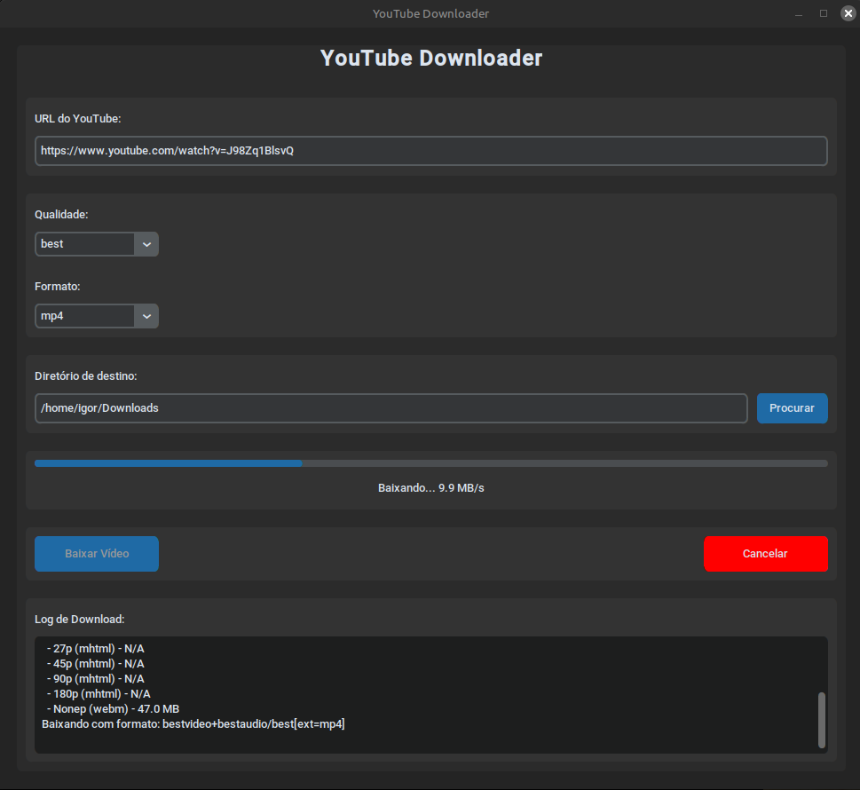

# YouTube Downloader



Um software em Python para fazer download de vídeos do YouTube com interface gráfica moderna.

## Características

- Interface gráfica moderna e intuitiva usando CustomTkinter
- Suporte a diferentes qualidades de vídeo (best, worst, 720p, 480p, 360p)
- Múltiplos formatos de saída (MP4, WebM, MKV)
- Barra de progresso em tempo real
- Seleção de diretório de destino
- Log detalhado do processo de download
- Validação de URLs do YouTube
- Possibilidade de cancelar downloads em andamento

## Instalação

### 1. **Instalar Python** (versão 3.7 ou superior)
   - Baixe em: https://www.python.org/downloads/

### 2. **Instalar dependências do sistema**

#### **Instalar tkinter (Interface gráfica)**
```bash
# Ubuntu/Debian
sudo apt update
sudo apt install python3-tk

# CentOS/RHEL/Fedora
sudo yum install python3-tkinter  # CentOS/RHEL
sudo dnf install python3-tkinter  # Fedora

# macOS
brew install python-tk
```

#### **Instalar FFmpeg** (Obrigatório para qualidades 720p, 480p, 360p)

#### **Windows:**
1. Acesse: https://ffmpeg.org/download.html
2. Clique em "Windows" e depois em "Windows builds from gyan.dev"
3. Baixe o arquivo "ffmpeg-release-essentials.zip"
4. Extraia o arquivo ZIP em uma pasta (exemplo: `C:\ffmpeg`)
5. Dentro da pasta extraída, entre em `bin` e você verá o arquivo `ffmpeg.exe`
6. **Adicionar ao PATH:**
   - Copie o caminho da pasta `bin` (exemplo: `C:\ffmpeg\bin`)
   - Painel de Controle → Sistema → Configurações Avançadas do Sistema → Variáveis de Ambiente
   - Em "Variáveis do sistema", encontre `Path`, selecione e clique em "Editar"
   - Clique em "Novo" e cole o caminho da pasta `bin`
   - Clique em OK em todas as janelas
7. **Teste:** Abra um novo terminal e digite:
   ```bash
   ffmpeg -version
   ```

#### **Linux (Ubuntu/Debian):**
```bash
sudo apt update
sudo apt install ffmpeg
```

#### **Linux (CentOS/RHEL/Fedora):**
```bash
# CentOS/RHEL
sudo yum install ffmpeg

# Fedora
sudo dnf install ffmpeg
```

#### **macOS:**
```bash
# Usando Homebrew
brew install ffmpeg

# Ou usando MacPorts
sudo port install ffmpeg
```

### 3. **Instalar dependências Python**

#### **Ambiente Virtual**
```bash
# Criar um ambiente virtual
python3 -m venv venv

# Ativar o ambiente virtual
source venv/bin/activate  # Linux/macOS
# ou
venv\Scripts\activate     # Windows

# Instalar dependências
pip install -r requirements.txt
```

## Como usar

### Interface Gráfica (Recomendado)

1. **Se estiver usando ambiente virtual, ative-o primeiro:**
   ```bash
   source venv/bin/activate  # Linux/macOS
   # ou
   venv\Scripts\activate     # Windows
   ```

2. Execute o programa principal:
   ```bash
   python youtube_downloader.py
   ```

2. Cole a URL do vídeo do YouTube no campo "URL do YouTube"

3. Configure as opções:
   - **Qualidade**: Escolha a qualidade desejada
   - **Formato**: Escolha o formato de saída
   - **Diretório**: Selecione onde salvar o arquivo

4. Clique em "Baixar Vídeo"

### Script Simples (Linha de Comando)

Para baixar o vídeo específico mencionado:
```bash
python test_download.py
```

## Estrutura do Projeto

```
youtube-downloader/
├── youtube_downloader.py    # Programa principal com interface gráfica
├── test_download.py         # Script simples para teste
├── requirements.txt         # Dependências do projeto
└── README.md               # Este arquivo
```

## Dependências

- `yt-dlp`: Biblioteca para download de vídeos do YouTube
- `customtkinter`: Interface gráfica moderna
- `tkinter`: Interface gráfica base (incluída com Python)

## Funcionalidades

### Interface Gráfica
- **URL Input**: Campo para colar URLs do YouTube
- **Configurações**: Seleção de qualidade e formato
- **Diretório**: Escolha onde salvar os arquivos
- **Progresso**: Barra de progresso em tempo real
- **Log**: Área de texto mostrando detalhes do download
- **Controles**: Botões para iniciar e cancelar downloads

### Qualidades de Vídeo
- **best**: Melhor qualidade disponível (requer ffmpeg)
- **worst**: Pior qualidade disponível (não requer ffmpeg)
- **720p**: Vídeo em 720p com áudio (requer ffmpeg)
- **480p**: Vídeo em 480p com áudio (requer ffmpeg)
- **360p**: Vídeo em 360p com áudio (requer ffmpeg)

**Nota:** Qualidades 720p, 480p e 360p fazem o merge automático de vídeo e áudio usando ffmpeg.

### Validação
- Verifica se a URL é válida do YouTube
- Confirma se o diretório de destino existe
- Valida se a URL foi fornecida

### Tratamento de Erros
- Mensagens de erro claras
- Log detalhado de problemas
- Recuperação graciosa de falhas

## Exemplo de Uso

1. Abra o programa
2. Cole a URL: `https://www.youtube.com/watch?v=6E5jpNC1iR0`
3. Escolha qualidade "best" e formato "mp4"
4. Selecione o diretório de destino
5. Clique em "Baixar Vídeo"
6. Aguarde o download ser concluído

## Notas Importantes

- O software usa `yt-dlp`, uma versão atualizada e mantida do `youtube-dl`
- Downloads são executados em threads separadas para não travar a interface
- O programa suporta URLs do YouTube padrão e URLs curtas (youtu.be)
- Arquivos são salvos com o nome do título do vídeo

## Solução de Problemas

### Erro de Importação
Se houver erro ao importar `customtkinter`:
```bash
pip install customtkinter
```

### Erro de FFmpeg
**Erro:** "You have requested merging of multiple formats but ffmpeg is not installed"

**Solução:**
1. Instale o ffmpeg seguindo as instruções na seção de instalação
2. Verifique se o ffmpeg está no PATH:
   ```bash
   ffmpeg -version
   ```
3. Se não funcionar, reinicie o terminal/PowerShell
4. Para Windows, certifique-se de que o caminho foi adicionado corretamente ao PATH

### Erro de Download
- Verifique sua conexão com a internet
- Confirme se a URL é válida
- Tente uma qualidade diferente
- Se o erro persistir com qualidades específicas, tente usar "worst" primeiro

### Erro de Permissão
- Certifique-se de que o diretório de destino tem permissões de escrita
- Execute como administrador se necessário

### Qualidade não corresponde ao esperado
- Alguns vídeos podem não ter todas as qualidades disponíveis
- O programa mostrará as qualidades disponíveis no log
- Use "best" para obter a melhor qualidade disponível

## Licença

Este projeto é de código aberto e pode ser usado livremente. 